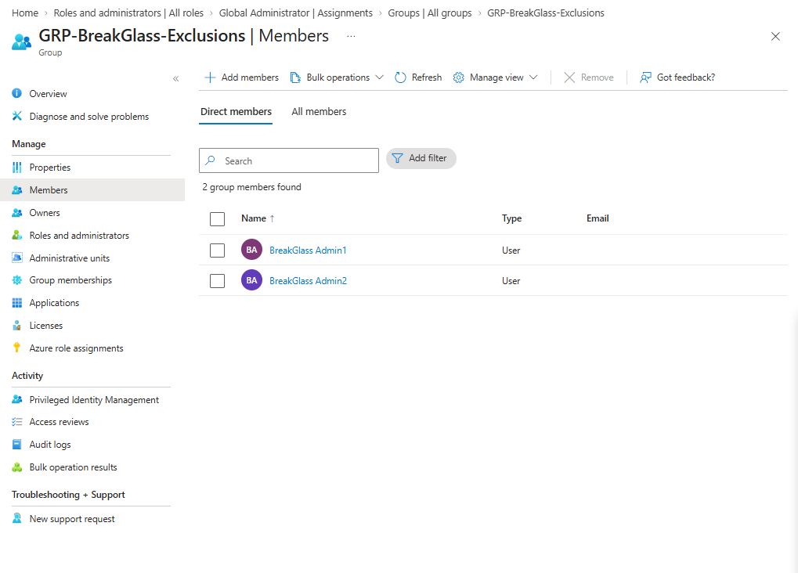

# Lab 01: Emergency Access (Break-Glass) Account Implementation

## Overview
This lab establishes dedicated emergency access (break-glass) accounts in Microsoft Entra ID to prevent administrative lockout during tenant-wide Conditional Access outages or identity provider disruptions.

## Architectural Design
* **Cloud-Only Identities:** Provisioned natively within `MMSPLLC2.onmicrosoft.com` with no on-premises Active Directory synchronization dependencies.
* **Role Assignment:** Assigned permanent **Global Administrator** privileges.
* **Exclusion Strategy:** Assigned to `GRP-BreakGlass-Exclusions` to ensure exclusion from restrictive Conditional Access policies (MFA enforcement, trusted location rules).
* **Credential Protection:** Passwords managed offline and stored outside version control via `.env` isolation (`.gitignore`).

## Executed Configuration
1. Created cloud-only accounts: `bgadmin1` and `bgadmin2`.
2. Assigned **Global Administrator** directory role to both identities.
3. Created security group `GRP-BreakGlass-Exclusions` and added both accounts as direct members.

4. Established `.env` secret tracking rules and verified clean repository state.