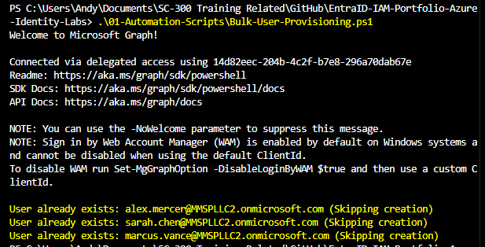
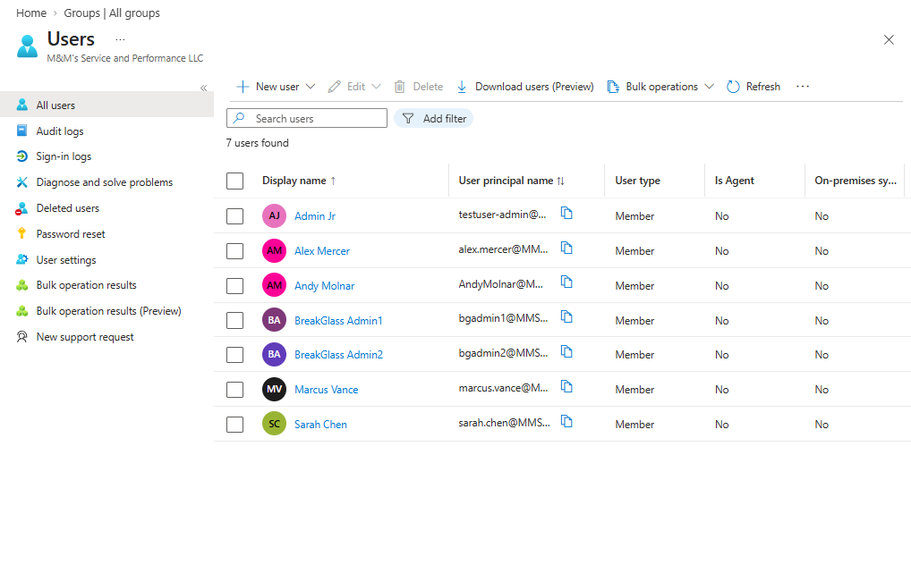

# Lab 02: Identity Lifecycle Management & Bulk Provisioning

## Objective
Automate the mass creation of mock user identities in Microsoft Entra ID using the Microsoft Graph PowerShell SDK, ensuring script idempotency and compliance with downstream licensing prerequisites.

---

## Architecture & Implementation
* **Idempotent Automation**: The provisioning script checks the tenant via `Get-MgUser` before attempting creation to prevent duplicate object errors (`400 BadRequest`) on subsequent runs.
* **Property Compliance**: Explicitly assigns required properties (`DisplayName`, `GivenName`, `Surname`, `UserPrincipalName`, `MailNickname`, and temporary `PasswordProfile`) alongside an `Update-MgUser` call to set the `-UsageLocation`.

---

## Execution Walkthrough

### 1. Script Execution
The automation script reads from a local CSV file, validates identity existence, and gracefully skips existing test accounts:

### 2. Entra ID Portal Verification
Validated via the Microsoft Entra admin center (`M&M's Service and Performance LLC`), confirming successfully provisioned user objects (`Alex Mercer`, `Sarah Chen`, `Marcus Vance`) ready for role and group assignment testing:

